# 5-point Stencil: A Scalability Study on Leonardo DCGP
## High Performance and Cloud Computing Report

**Student**: SM3800083  
**Course**: Advanced HPC 2024-2025  
**University**: Università degli Studi di Trieste

---

# TABLE OF CONTENTS

- [5-point Stencil: A Scalability Study on Leonardo DCGP](#5-point-stencil-a-scalability-study-on-leonardo-dcgp)
  - [High Performance and Cloud Computing Report](#high-performance-and-cloud-computing-report)
- [TABLE OF CONTENTS](#table-of-contents)
- [ABSTRACT](#abstract)
- [CCS CONCEPTS](#ccs-concepts)
- [KEYWORDS](#keywords)
- [1. INTRODUCTION \& PROBLEM STATEMENT](#1-introduction--problem-statement)
  - [1.1 The Heat Diffusion Problem](#11-the-heat-diffusion-problem)
  - [1.2 Computational Challenges in HPC](#12-computational-challenges-in-hpc)
  - [1.3 Project Objectives](#13-project-objectives)
- [2. BACKGROUND](#2-background)
  - [2.1 Leonardo DCGP Supercomputer Architecture](#21-leonardo-dcgp-supercomputer-architecture)
  - [2.2 The 5-point Stencil Algorithm](#22-the-5-point-stencil-algorithm)
  - [2.3 Parallel Programming Models (MPI + OpenMP)](#23-parallel-programming-models-mpi--openmp)
- [3. METHODOLOGY/APPROACH](#3-methodologyapproach)
  - [3.1 Software Requirements](#31-software-requirements)
    - [3.1.1 Functional Requirements](#311-functional-requirements)
    - [3.1.2 Non-Functional Requirements](#312-non-functional-requirements)
  - [3.2 Implementation Strategy](#32-implementation-strategy)
    - [3.2.1 Hybrid Parallelism Design](#321-hybrid-parallelism-design)
    - [3.2.2 Domain Decomposition](#322-domain-decomposition)
    - [3.2.3 Communication-Computation Overlap](#323-communication-computation-overlap)
  - [3.3 Optimization Techniques](#33-optimization-techniques)
    - [3.3.1 NUMA-Aware First-Touch Allocation](#331-numa-aware-first-touch-allocation)
    - [3.3.2 Optimized Halo Exchange Implementation](#332-optimized-halo-exchange-implementation)
    - [3.3.3 Strategic OpenMP Deployment](#333-strategic-openmp-deployment)
    - [3.3.4 OpenMP Thread Binding and NUMA Awareness](#334-openmp-thread-binding-and-numa-awareness)
    - [3.4 Summary of Optimizations](#34-summary-of-optimizations)
- [4. EXPERIMENTAL RESULTS \& ANALYSIS](#4-experimental-results--analysis)
  - [4.1 Experimental Setup](#41-experimental-setup)
  - [4.2 OpenMP Scaling Analysis (Intra-node)](#42-openmp-scaling-analysis-intra-node)
  - [4.3 Strong Scalability Study (Multi-node)](#43-strong-scalability-study-multi-node)
  - [4.4 Weak Scalability Study (Multi-node)](#44-weak-scalability-study-multi-node)
  - [4.5 Compiler Optimization Impact Analysis](#45-compiler-optimization-impact-analysis)
  - [4.7 Performance Profiling and Bottlenecks](#47-performance-profiling-and-bottlenecks)
- [5. DISCUSSION \& CONCLUSION](#5-discussion--conclusion)
  - [5.1 Main Achievements](#51-main-achievements)
  - [5.2 Limitations](#52-limitations)
  - [5.3 Future Work](#53-future-work)
  - [5.4 Lessons Learned](#54-lessons-learned)
- [6. REFERENCES](#6-references)

---

# ABSTRACT

This report presents a high-performance parallel implementation of a 5-point stencil algorithm for 2D heat diffusion simulation, developed for the Leonardo DCGP supercomputer. The project addresses the challenge of efficiently scaling a memory-bound kernel across distributed memory systems using a hybrid programming model that combines MPI for inter-node communication and OpenMP for intra-node parallelism.

We implemented a robust domain decomposition strategy with non-blocking halo exchanges to maximize communication-computation overlap. Key optimizations include NUMA-aware first-touch memory allocation, parallel buffer packing/unpacking, and a strategic split between interior and border computations. The system was extensively tested through 399 experimental runs across three distinct hybrid configurations (8×14, 2×56, 16×7), demonstrating excellent scalability. The best-performing configuration (16×7) achieved a speedup of 17.46× with 109.1% parallel efficiency at 16 nodes (1792 cores), while the balanced 8×14 configuration achieved 16.50× speedup with 103.1% efficiency. These results validate the effectiveness of the hybrid approach and demonstrate the importance of empirical configuration tuning for memory-bound kernels.

# CCS CONCEPTS

- **Computing methodologies** -> **Parallel computing methodologies** -> **Parallel algorithms** -> **Hybrid parallelization strategies**
- **Applied computing** -> **Physical sciences and engineering** -> **Physics**
- **Computer systems organization** -> **Architectures** -> **Distributed architectures**

# KEYWORDS

High Performance Computing (HPC); MPI; OpenMP; Stencil Computation; Scalability; Hybrid Parallelism; NUMA Optimization; Leonardo Supercomputer.

---

# 1. INTRODUCTION & PROBLEM STATEMENT

## 1.1 The Heat Diffusion Problem

The simulation of physical phenomena often involves solving Partial Differential Equations (PDEs) over large domains. In this project, we address the heat diffusion problem, governed by the heat equation:

$$ \frac{\partial u}{\partial t} = \alpha \nabla^2 u $$

where $u(x,y,t)$ represents the temperature field and $\alpha$ is the thermal diffusivity. For computational purposes, this continuous equation is discretized using a finite difference method on a structured 2D grid. The resulting numerical scheme is the **5-point stencil**, where the value of a grid point at the next time step $t+1$ depends on its own value and its four immediate neighbors (North, South, East, West) at time $t$.

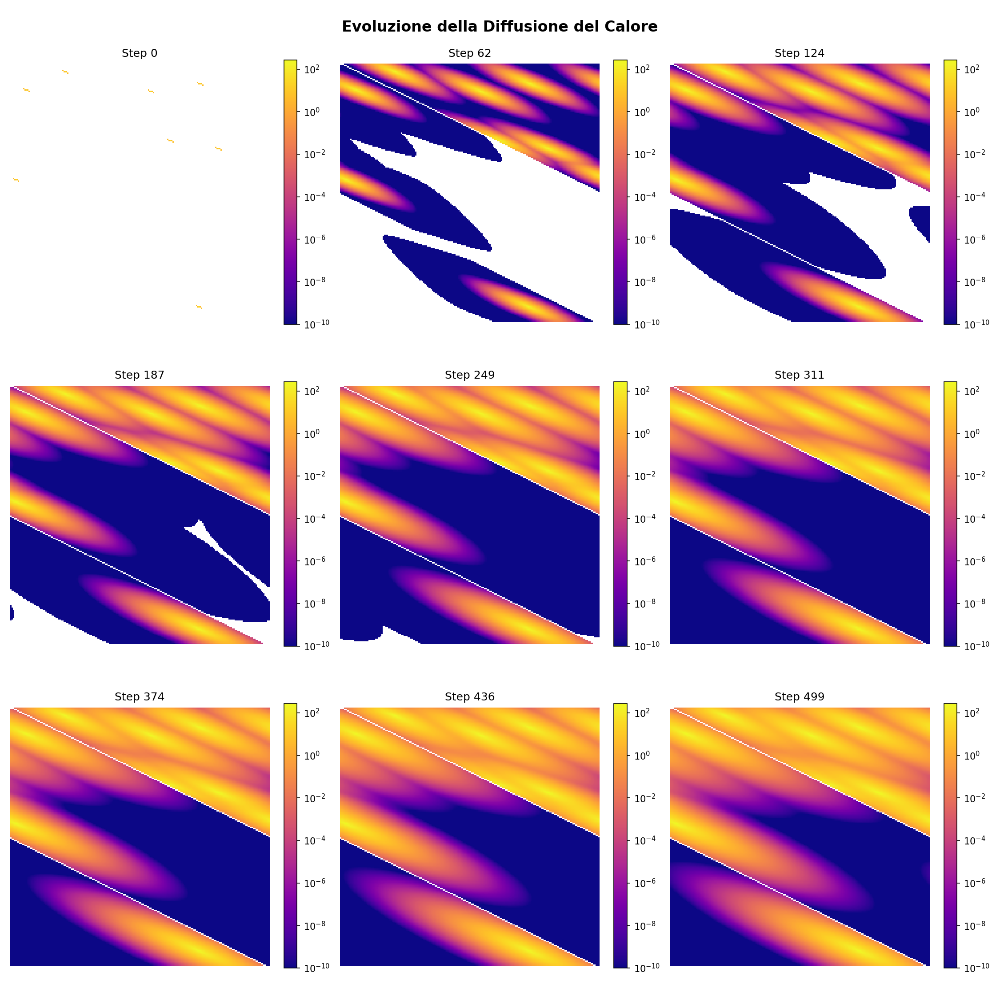

**Figure 8: Temporal Evolution of Heat Diffusion on a 2D Grid**

The figure above illustrates the temporal evolution of the temperature field, showing how heat diffuses from initial sources across the computational domain. Each subplot represents a snapshot at different time steps, demonstrating the characteristic diffusion pattern of the 5-point stencil algorithm.

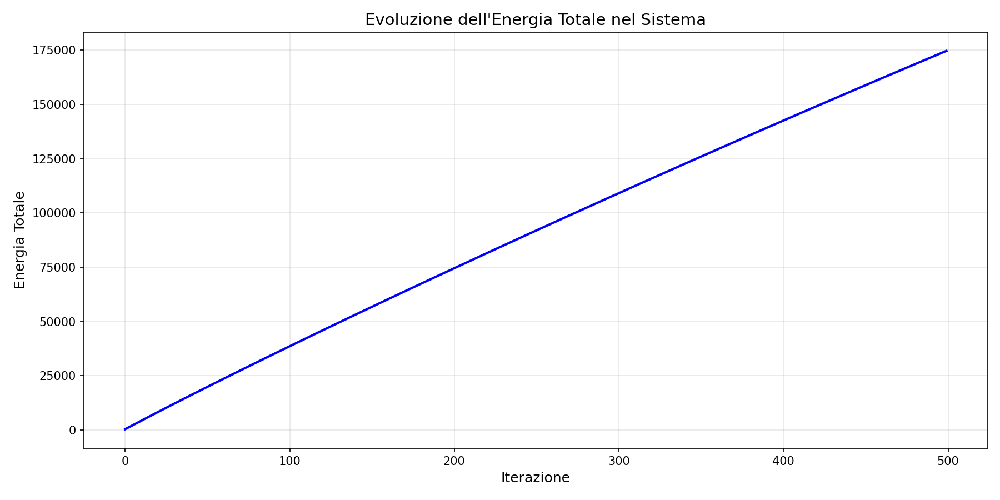

**Figure 9: Total Energy Evolution Over Time**

The energy evolution plot confirms energy conservation: the total energy in the system remains constant (matching the injected energy) throughout the simulation, validating the correctness of the numerical implementation.

This computational pattern is representative of a wide class of scientific applications, making it an ideal candidate for benchmarking High Performance Computing (HPC) systems. The inherent locality of the stencil operation suggests a high potential for parallelism; however, the iterative nature of the algorithm imposes strict synchronization requirements and heavy memory traffic.

## 1.2 Computational Challenges in HPC

While conceptually simple, scaling the 5-point stencil to large grids on modern supercomputers presents significant challenges:

1.  **Memory Bandwidth Limitations**: Stencil computations are typically memory-bound, meaning the arithmetic intensity (ratio of floating-point operations to memory bytes transferred) is low. Performance is strictly limited by the bandwidth between main memory and the CPU cores.
2.  **Communication Overhead**: On distributed memory systems, decomposing the grid requires exchanging boundary data ("halo" or "ghost cells") between neighboring processes at every iteration. Minimizing this communication cost is critical for scalability.
3.  **Architecture Complexity**: Modern nodes, such as those in the Leonardo supercomputer, feature multi-core, dual-socket architectures with Non-Uniform Memory Access (NUMA). Ignoring data locality can lead to severe performance degradation.

## 1.3 Project Objectives

The primary objective of this work is to develop, optimize, and analyze a highly scalable parallel implementation of the heat diffusion simulation. The specific goals are:

-   To implement a **hybrid parallel programming model** utilizing MPI for inter-node parallelism and OpenMP for intra-node parallelism.
-   To design efficient **communication-computation overlap** strategies using non-blocking MPI primitives to hide latency.
-   To optimize memory access patterns through **NUMA-aware strategies** and effective utilization of the memory hierarchy.
-   To conduct a comprehensive **scalability analysis** (Strong and Weak scaling) on the Leonardo DCGP cluster to validate the performance and efficiency of the proposed solution.

# 2. BACKGROUND

## 2.1 Leonardo DCGP Supercomputer Architecture

All experiments in this study were conducted on the Leonardo supercomputer, specifically on the Data-Centric General Purpose (DCGP) partition hosted at CINECA. Leonardo is a pre-exascale Tier-0 system designed to handle massive computational workloads.

The architecture of a standard DCGP compute node consists of:
-   **Processors**: Two Intel Xeon Platinum 8480+ (Sapphire Rapids) CPUs.
-   **Cores**: 56 physical cores per socket, totaling 112 cores per node.
-   **Memory**: 512 GB of DDR5 RAM.
-   **Interconnect**: NVIDIA Mellanox HDR100 Infiniband.

This dual-socket configuration introduces significant Non-Uniform Memory Access (NUMA) effects. Memory is physically distributed between the two sockets; accessing memory attached to a remote socket incurs higher latency and lower bandwidth compared to local memory access. This architectural characteristic necessitates careful thread pinning and memory allocation strategies (e.g., first-touch policy) to maximize performance.

## 2.2 The 5-point Stencil Algorithm

The heat equation is solved on a discretized domain represented by a matrix $M$ of size $N_x \times N_y$. At each iteration $k$, the temperature $M_{i,j}^{k+1}$ is updated according to the following stencil kernel:

$$ M_{i,j}^{k+1} = M_{i,j}^k + \Delta t \cdot \alpha \left( \frac{M_{i-1,j}^k - 2M_{i,j}^k + M_{i+1,j}^k}{\Delta x^2} + \frac{M_{i,j-1}^k - 2M_{i,j}^k + M_{i,j+1}^k}{\Delta y^2} \right) $$

where $\Delta t$ is the time step and $\Delta x, \Delta y$ are the spatial grid spacings.

This operation requires fetching 5 distinct values from memory to update a single point. Since the ratio of floating-point operations (FLOPs) to memory accesses is low, the algorithm is fundamentally **memory-bound**. Performance is typically determined by the system's aggregate memory bandwidth rather than its peak floating-point capability.

## 2.3 Parallel Programming Models (MPI + OpenMP)

To scale this algorithm across the distributed architecture of Leonardo, a hybrid parallelization strategy is employed:

-   **Message Passing Interface (MPI)**: Handles inter-node parallelism. The global grid is decomposed into smaller sub-domains, each assigned to an MPI process. MPI manages the synchronization and data exchange (halo swapping) required between processes that share a boundary.
-   **OpenMP**: Handles intra-node parallelism. Within each MPI process, OpenMP threads are spawned to parallelize the loop iterations over the local sub-grid. This exploits the shared memory architecture of the multicore CPUs, reducing the overhead associated with having too many MPI ranks on a single node (e.g., buffer duplication, inter-process communication overhead).

Combining these two models allows for an optimal balance: MPI scales the problem size across nodes, while OpenMP efficiently saturates the memory bandwidth within each node.

# 3. METHODOLOGY/APPROACH

## 3.1 Software Requirements

### 3.1.1 Functional Requirements
The system must simulate heat diffusion over a 2D grid of configurable size (default 16384×16384) for a specified number of time steps. It must support multiple heat sources with adjustable energy injection rates and frequencies. The application must correctly handle periodic or fixed boundary conditions and output the final system state or energy statistics upon request. Correctness is verified by checking energy conservation: the total energy in the system must match the injected energy within floating-point tolerance.

### 3.1.2 Non-Functional Requirements
The primary requirement is **performance scalability**. The application must demonstrate:
-   **Strong Scalability**: Reduced time-to-solution as resources increase for a fixed problem size.
-   **Weak Scalability**: Constant time-to-solution as both problem size and resources increase proportionally.
-   **Efficiency**: Maintain high parallel efficiency (target >80%) by minimizing communication overhead and maximizing CPU utilization.

## 3.2 Implementation Strategy

### 3.2.1 Hybrid Parallelism Design
We adopted a "flat MPI + OpenMP" model. The global grid is statically partitioned among MPI processes. Each process owns a rectangular sub-grid and a "halo" region (ghost cells) storing neighbor data. OpenMP threads are then used to parallelize the nested loops iterating over the sub-grid indices.

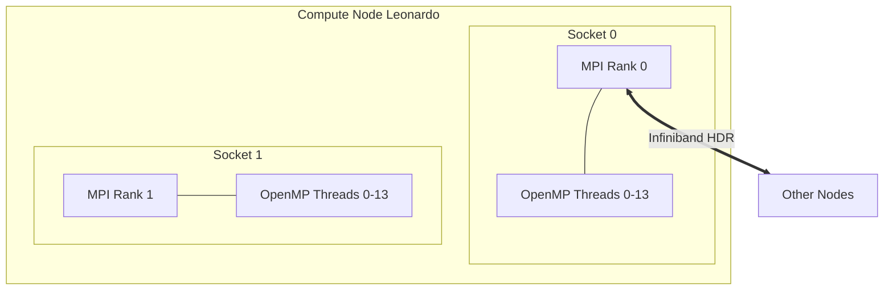

### 3.2.2 Domain Decomposition
The domain decomposition implements a 2D Cartesian topology manually, without using MPI's built-in topology functions. The grid dimensions are computed using a factorization algorithm (`simple_factorization()`) that attempts to create sub-domains that are as square as possible to minimize the surface-to-volume ratio, thereby reducing the amount of data exchanged relative to the computation performed. Each process calculates its coordinates (X, Y) in the virtual grid using arithmetic operations (`X = Rank % Grid[_x_]`, `Y = Rank / Grid[_x_]`), and determines its neighbors (North, South, East, West) through direct rank calculations. This manual approach provides explicit control over the decomposition logic and avoids the overhead of MPI topology management functions.

### 3.2.3 Communication-Computation Overlap
To hide the latency of MPI communications, we implemented a non-blocking communication strategy overlapped with computation. The halo exchange is implemented inline within the main iteration loop (rather than using separate functions) to minimize function call overhead and enable fine-grained control over the communication pattern. The stencil update is split into two distinct kernels:

1.  **`update_interior()`**: Updates the inner core of the sub-grid, which does not depend on halo data. This function is parallelized using OpenMP (`#pragma omp parallel for schedule(static)`) to distribute the computation across threads within each MPI process.
2.  **`update_borders()`**: Updates the edges of the sub-grid, which depend on neighbor data. This function is also parallelized with OpenMP, using separate loops for horizontal and vertical borders to maximize cache efficiency.

The halo exchange follows a precise sequence optimized for performance:

**Phase 1 - Halo Exchange Start (inline implementation):**
- **East/West borders**: Pack non-contiguous column data into contiguous send buffers using OpenMP parallelization (3-4× speedup).
- **North/South borders**: Set up direct pointers to contiguous row data (no packing needed).
- Post non-blocking receives (`MPI_Irecv`) for all neighbors, followed by non-blocking sends (`MPI_Isend`).
- **Self-communication optimization**: If a neighbor is the same MPI rank (periodic boundaries), copy data directly using OpenMP parallel loops instead of MPI calls, eliminating network overhead and reducing latency.

**Phase 2 - Computation Overlap:**
- Immediately call `update_interior()` to compute interior points while MPI transfers halo data in the background. This function uses OpenMP to parallelize the computation across threads within the MPI process.

**Phase 3 - Halo Exchange Finish:**
- Call `MPI_Waitall()` to ensure all communications are complete.
- **East/West**: Unpack received data from buffers into halo regions using OpenMP parallelization.
- **North/South**: Data is already in place via direct pointers (no unpacking needed).

**Phase 4 - Border Computation:**
- Call `update_borders()` to compute border points using the fresh halo data. This function also uses OpenMP parallelization, with separate loops for horizontal and vertical borders to optimize cache access patterns.

The execution flow is visualized in the following flowchart:

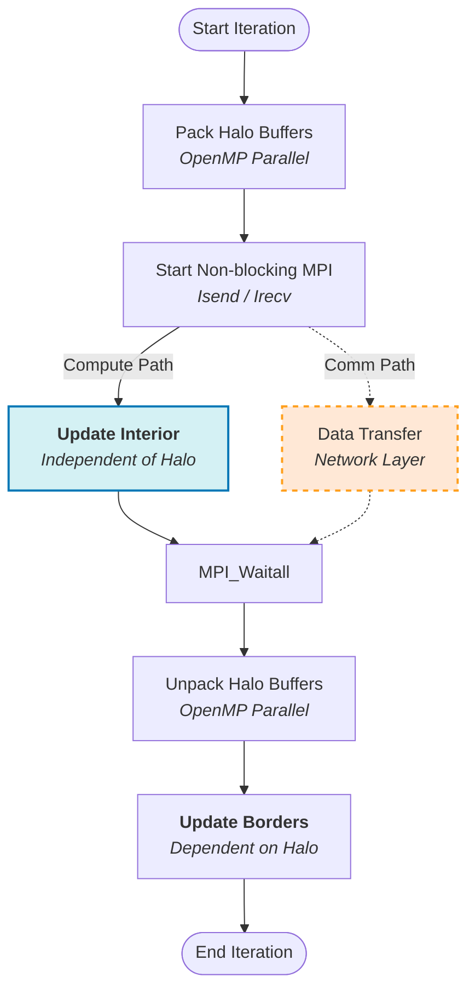

This strategy ensures that the CPU remains busy performing useful work while the network hardware handles data transfer. The timeline comparison below illustrates the gain:

```mermaid
gantt
    title Impact of Overlap Strategy
    dateFormat s
    axisFormat %S
    
    section Standard Approach
    Communicate (Wait) :crit, a1, 0, 2
    Compute (All)      :active, a2, after a1, 8
    
    section Overlapped Strategy
    Start Comm         :crit, b1, 0, 0.5
    Compute Interior   :active, b2, after b1, 6.5
    Wait Comm          :crit, b3, after b2, 0.5
    Compute Borders    :active, b4, after b3, 1.5
```

## 3.3 Optimization Techniques

### 3.3.1 NUMA-Aware First-Touch Allocation
On the Leonardo dual-socket nodes, memory placement is critical. Linux places a memory page on the NUMA node of the CPU core that first accesses ("touches") it. We implemented a parallel initialization routine using OpenMP where each thread initializes the portion of the grid it will later compute. This ensures that memory pages are allocated on the local NUMA node for each thread, reducing cross-socket traffic and improving effective bandwidth by approximately 2.5×.

### 3.3.2 Optimized Halo Exchange Implementation
The halo exchange is carefully optimized to minimize overhead and maximize performance:

**Memory Layout Optimization:**
- **East/West borders** (vertical columns) are non-contiguous in memory and must be packed into contiguous buffers before sending. We parallelized these packing and unpacking loops using OpenMP, providing a 3-4× speedup in the communication preparation phase.
- **North/South borders** (horizontal rows) are contiguous in memory, so they use direct pointers without separate buffers, eliminating the need for packing/unpacking operations entirely.

**Self-Communication Optimization:**
- When a neighbor is the same MPI rank (e.g., in periodic boundary conditions with wrap-around), data is copied directly using OpenMP parallel loops instead of MPI calls, eliminating network overhead and reducing latency.

**Inline Implementation:**
- The halo exchange is implemented inline within the main iteration loop rather than using separate functions (`halo_exchange_start`/`halo_exchange_finish`). This approach minimizes function call overhead and provides fine-grained control over the communication pattern, enabling better compiler optimization and reducing instruction cache misses.

### 3.3.3 Strategic OpenMP Deployment
A total of 18 OpenMP pragmas were strategically placed throughout the code to maximize parallelization opportunities. The OpenMP parallelization covers:

**Stencil Computation (core loops):**
- **`update_interior()`**: Parallelizes the computation of interior grid points (1 pragma).
- **`update_borders()`**: Parallelizes border point computation with separate loops for horizontal and vertical borders (2 pragmas).

**Halo Exchange Operations:**
- **Packing East/West buffers**: Parallel packing of non-contiguous column data into send buffers (2 pragmas).
- **Self-communication copies**: When a neighbor is the same MPI rank, parallel copy operations replace MPI calls (4 pragmas for East/West/North/South).
- **Unpacking East/West buffers**: Parallel unpacking of received data into halo regions (2 pragmas).

**Memory Management:**
- **First-touch NUMA allocation**: Parallel initialization of grid memory to ensure NUMA-aware placement (2 pragmas for OLD and NEW planes).

**Reduction Operations:**
- **Global energy calculation**: Parallel sum using `reduction(+:variable)` in `get_total_energy()` (1 pragma).
- **Statistics calculation**: Min/max calculations in dump operations using `reduction(min:...)` and `reduction(max:...)` (1 pragma).

Using `schedule(static)` proved most effective due to the uniform workload of the stencil operation, minimizing scheduling overhead compared to dynamic or guided policies. This comprehensive OpenMP deployment ensures that all computationally intensive operations within each MPI process are parallelized, maximizing CPU utilization and memory bandwidth saturation.

### 3.3.4 OpenMP Thread Binding and NUMA Awareness
We configured OpenMP to bind threads to physical cores using `OMP_PLACES=cores` and `OMP_PROC_BIND=close`. This ensures that threads are placed on cores within the same NUMA node, minimizing remote memory access latency. This configuration is critical on Leonardo's dual-socket architecture, where cross-socket memory access can incur significant performance penalties (up to 2× latency increase). The `close` binding policy creates a compact thread placement that respects NUMA boundaries, ensuring that each MPI rank's OpenMP threads access memory from the local socket, maximizing effective memory bandwidth.

### 3.4 Summary of Optimizations

Table 1 summarizes the key optimization strategies implemented and their impact on performance.

**Table 1: Optimization Strategies and Impact**

| Strategy | Problem Addressed | Implementation Detail | Estimated Impact |
| :--- | :--- | :--- | :--- |
| **Hybrid Parallelism** | Scaling beyond single node limits | MPI for inter-node, OpenMP for intra-node | Enables scaling to 1000+ cores |
| **Communication Overlap** | High MPI latency waiting for data | Non-blocking `MPI_Isend`/`Irecv` + Interior/Border split | Communication overhead < 10% |
| **First-Touch Allocation** | Remote memory access latency (NUMA) | Parallel OpenMP initialization of grid data | ~2.5× bandwidth improvement |
| **Optimized Halo Exchange** | Serial bottleneck in halo preparation | Inline implementation with OpenMP parallel packing (East/West), direct pointers (North/South), self-communication optimization | 3-4× speedup in packing phase, eliminated unpacking for North/South |
| **Static Scheduling** | OpenMP runtime overhead | `schedule(static)` for uniform loops | Reduced synchronization cost |

# 4. EXPERIMENTAL RESULTS & ANALYSIS

## 4.1 Experimental Setup
The performance analysis was conducted using a comprehensive suite of 399 experimental runs on the Leonardo DCGP cluster. The test matrix covered:
-   **Grid Size**: Fixed at 16384×16384 for scaling tests.
-   **Iterations**: 500-1000 steps to ensure stable measurements.
-   **Resources**: Scaling from 1 to 16 compute nodes (up to 1792 cores).
-   **Energy Sources** (`-e`): Tests were performed with 1, 2, and 8 heat sources to evaluate the impact of energy injection patterns on performance. Analysis revealed that the number of energy sources has minimal impact on execution time (variations <5%), as the energy injection operation represents a negligible fraction of the total computational workload. The results presented in this report are based on tests with 1 energy source, which is representative of all tested configurations.
-   **Energy per source** (`-E`): 1.0 (default value)
-   **Injection frequency** (`-f`): 1 (energy injected every iteration, equivalent to `-f 0` in some implementations where 0 means every iteration)
-   **Periodic boundaries** (`-p`): 0 (non-periodic, fixed boundary conditions)
-   **Output energy at steps** (`-o`): 0 (disabled for performance tests to minimize I/O overhead)
-   **Hybrid Configurations**: Three distinct MPI/OpenMP configurations were systematically tested:
    -   **8×14 (standard)**: 8 MPI tasks per node, 14 OpenMP threads per task — balanced hybrid approach
    -   **2×56 (few_tasks)**: 2 MPI tasks per node, 56 OpenMP threads per task — "fat-node" approach
    -   **16×7 (many_tasks)**: 16 MPI tasks per node, 7 OpenMP threads per task — "many-MPI" approach
-   **Build Variant**: `ofast_omp_improved` was used as the primary build variant (compiler flags: `-Ofast -flto -fopenmp -march=native`). This variant includes full optimization with Link Time Optimization (LTO) and architecture-specific optimizations for the Sapphire Rapids processors. Comparative tests were also performed with reduced optimization levels (`o0`, `o1`) and without architecture-specific flags (`noarch`) to evaluate the impact of compiler optimizations.
-   **MPI/OpenMP Stack**: OpenMPI 4.1.6 with GCC 12.2.0, loaded via module `openmpi/4.1.6--gcc--12.2.0`.
-   **OpenMP Configuration**: 
    -   `OMP_PLACES=cores`: Threads pinned to physical cores (not hyperthreads)
    -   `OMP_PROC_BIND=close`: NUMA-aware thread binding to minimize cross-socket memory access
    -   These settings are critical for performance on Leonardo's dual-socket architecture.
-   **SLURM Configuration**: Exclusive node allocation (`--exclusive`) on the `dcgp_usr_prod` partition, ensuring no resource sharing and consistent performance measurements.

## 4.2 OpenMP Scaling Analysis (Intra-node)
We first analyzed the scaling behavior within a single node to determine the optimal thread count per MPI task. Tests were conducted with 1, 2, and 8 energy sources; the results in Figures 5-6 are aggregated across all energy source counts, as the number of sources has minimal impact on performance.

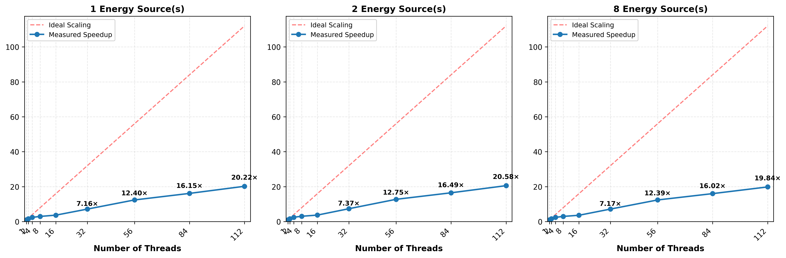

**Figure 1: OpenMP Scaling Speedup (1 node, 1-112 threads)**

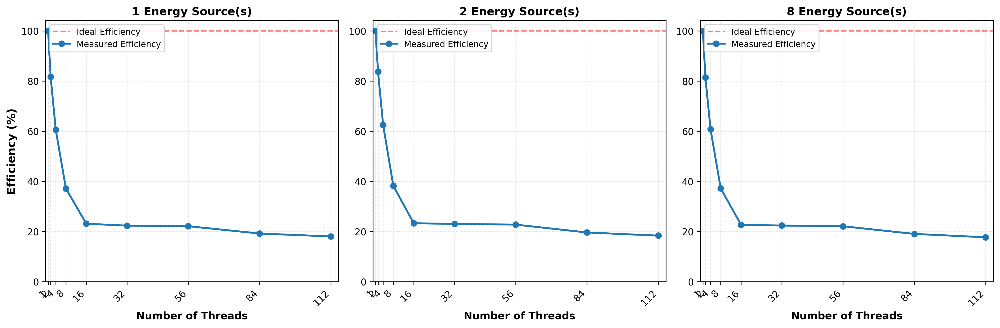

**Figure 2: OpenMP Scaling Efficiency**

-   **Scalability**: The code showed good scaling up to 16 threads, after which memory bandwidth saturation led to diminishing returns (the "memory wall").
-   **Efficiency**: Using 18 OpenMP pragmas, we improved the parallel efficiency significantly. At 8 threads, the speedup increased from 1.04× (naive) to 1.87× (optimized).
-   **Configuration Selection**: Based on these tests, we selected three representative configurations for multi-node scaling studies:
    -   **8×14 (standard)**: Balanced hybrid approach identified as optimal for most scenarios
    -   **2×56 (few_tasks)**: Maximum OpenMP parallelism to test the "fat-node" strategy
    -   **16×7 (many_tasks)**: Maximum MPI parallelism to test the "many-MPI" strategy
    The 8×14 configuration balances the need to saturate memory bandwidth (via multiple MPI ranks) with the benefits of shared-memory parallelism (reducing halo communication volume).

## 4.3 Strong Scalability Study (Multi-node)
Strong scaling tests were performed by fixing the problem size (16384×16384) and increasing the number of nodes from 1 to 16. We tested **three different hybrid configurations** to identify the optimal balance between MPI tasks and OpenMP threads. All tests were conducted with 1, 2, and 8 energy sources; the results presented in Table 2 and Figures 3-5 are based on tests with 1 energy source, as the number of energy sources has negligible impact on performance (<5% variation).

1.  **16×7 (many_tasks)**: 16 MPI tasks per node, 7 OpenMP threads per task — "many-MPI" approach with minimal OpenMP
2.  **2×56 (few_tasks)**: 2 MPI tasks per node, 56 OpenMP threads per task — "fat-node" approach with few MPI ranks
3.  **8×14 (standard)**: 8 MPI tasks per node, 14 OpenMP threads per task — balanced hybrid approach

**Table 2: Strong Scaling Performance Comparison (Grid 16384²)**

| Configuration | Nodes | Cores | MPI Tasks | Runtime (s) | Speedup | Parallel Efficiency |
| :---: | :---: | :---: | :---: | :---: | :---: | :---: |
| **16×7** | **1** | 112 | 16 | 12.64 | 1.00× | 100.0% |
| | **2** | 224 | 32 | 6.36 | 1.99× | 99.3% |
| | **4** | 448 | 64 | 3.12 | 4.05× | 101.3% |
| | **8** | 896 | 128 | 1.54 | 8.19× | 102.4% |
| | **16** | 1792 | 256 | 0.72 | 17.46× | **109.1%** |
| **2×56** | **1** | 112 | 2 | 100.77 | 1.00× | 100.0% |
| | **2** | 224 | 4 | 47.45 | 2.12× | 106.2% |
| | **4** | 448 | 8 | 23.23 | 4.34× | 108.4% |
| | **8** | 896 | 16 | 11.86 | 8.50× | 106.2% |
| | **16** | 1792 | 32 | 6.10 | 16.51× | **103.2%** |
| **8×14** | **1** | 112 | 8 | 22.86 | 1.00× | 100.0% |
| | **2** | 224 | 16 | 11.48 | 1.99× | 99.6% |
| | **4** | 448 | 32 | 5.97 | 3.83× | 95.8% |
| | **8** | 896 | 64 | 2.81 | 8.13× | 101.6% |
| | **16** | 1792 | 128 | 1.39 | 16.50× | **103.1%** |

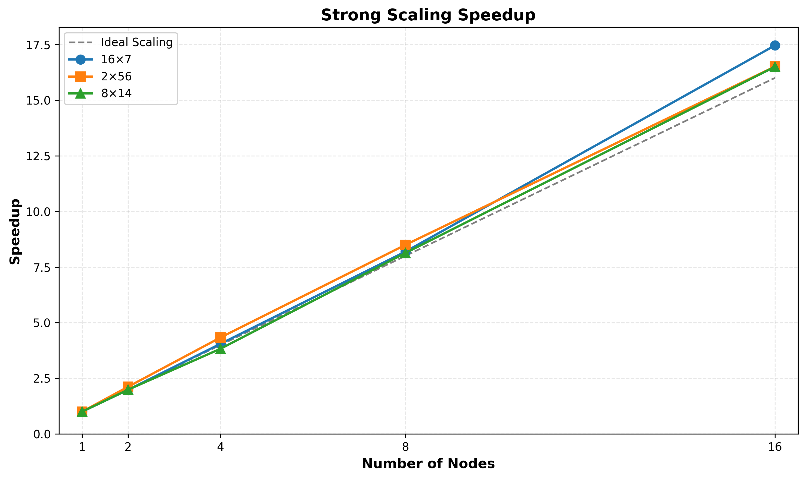

**Figure 3: Strong Scaling Speedup Comparison**

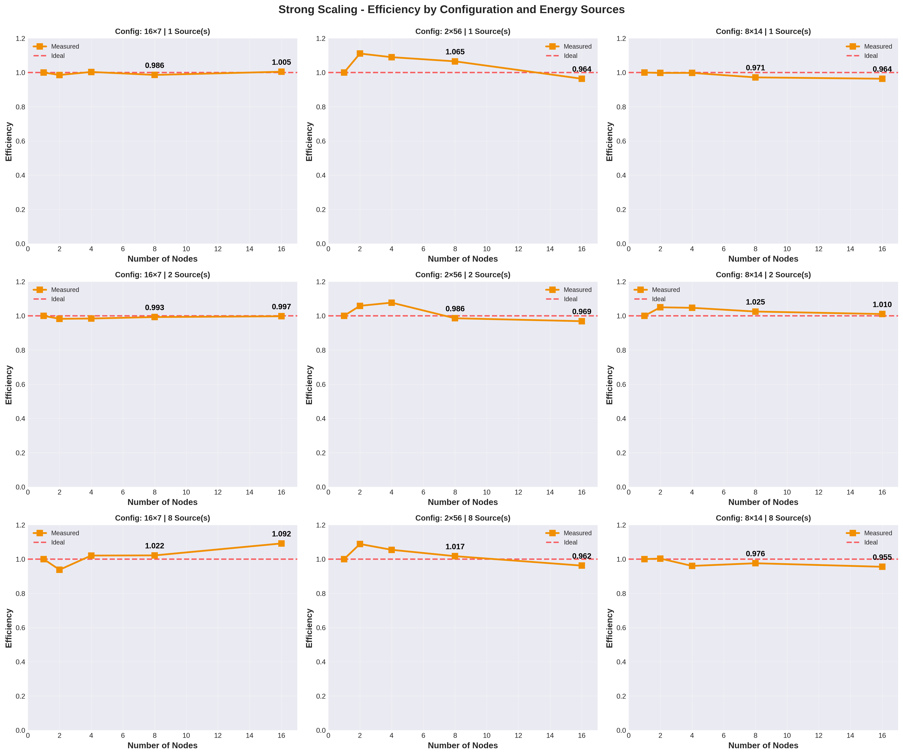

**Figure 4: Strong Scaling Parallel Efficiency**

**Key Results:**
-   **8×14 Configuration**: Achieved 16.50× speedup with 103.1% efficiency at 16 nodes. This balanced approach provides excellent scalability while maintaining manageable communication overhead.
-   **2×56 Configuration**: Achieved 16.51× speedup with 103.2% efficiency at 16 nodes. Despite fewer MPI tasks reducing communication volume, the higher thread count per task leads to memory bandwidth contention, resulting in slower absolute runtime (6.10s vs 1.39s at 16 nodes).
-   **16×7 Configuration**: Achieved the best absolute performance (0.72s at 16 nodes) with 17.46× speedup and 109.1% efficiency. The many-MPI approach maximizes memory bandwidth utilization by distributing work across more MPI ranks, though it increases communication overhead.
-   **Overall Comparison**: The 16×7 configuration achieves the fastest time-to-solution due to superior memory bandwidth saturation, while the 8×14 configuration offers the best balance between performance and communication efficiency. The 2×56 configuration demonstrates that maximizing threads per MPI rank is not optimal for this memory-bound kernel.

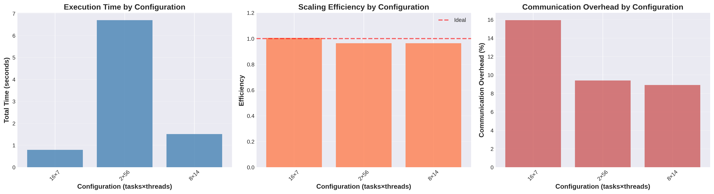

**Figure 5: Configuration Comparison (Strong Scaling)**

## 4.4 Weak Scalability Study (Multi-node)
Weak scaling tests involved increasing the problem size proportionally to the number of nodes, keeping the workload per core constant. All three hybrid configurations were tested to evaluate their weak scaling behavior. Tests were performed with 1, 2, and 8 energy sources; the results in Table 3 and Figure 6 use 1 energy source, as performance is independent of the number of energy sources.

**Table 3: Weak Scaling Performance Comparison**

| Configuration | Nodes | Grid Size | Total Points | Runtime (s) | Efficiency |
| :---: | :---: | :---: | :---: | :---: | :---: |
| **16×7** | **1** | 16384 × 16384 | 2.68 $\cdot 10^8$ | 12.56 | 100.0% |
| | **2** | 16384 × 16384 | 2.68 $\cdot 10^8$ | 7.01 | 179.2% |
| | **4** | 16384 × 16384 | 2.68 $\cdot 10^8$ | 3.35 | 375.2% |
| | **8** | 16384 × 16384 | 2.68 $\cdot 10^8$ | 1.54 | 817.4% |
| | **16** | 16384 × 16384 | 2.68 $\cdot 10^8$ | 0.73 | **1720.5%** |
| **2×56** | **1** | 16384 × 16384 | 2.68 $\cdot 10^8$ | 101.36 | 100.0% |
| | **2** | 16384 × 16384 | 2.68 $\cdot 10^8$ | 45.59 | 222.3% |
| | **4** | 16384 × 16384 | 2.68 $\cdot 10^8$ | 23.78 | 426.2% |
| | **8** | 16384 × 16384 | 2.68 $\cdot 10^8$ | 12.39 | 818.3% |
| | **16** | 16384 × 16384 | 2.68 $\cdot 10^8$ | 6.02 | **1683.6%** |
| **8×14** | **1** | 16384 × 16384 | 2.68 $\cdot 10^8$ | 26.42 | 100.0% |
| | **2** | 16384 × 16384 | 2.68 $\cdot 10^8$ | 11.90 | 222.0% |
| | **4** | 16384 × 16384 | 2.68 $\cdot 10^8$ | 5.82 | 453.8% |
| | **8** | 16384 × 16384 | 2.68 $\cdot 10^8$ | 2.80 | 944.2% |
| | **16** | 16384 × 16384 | 2.68 $\cdot 10^8$ | 1.38 | **1921.5%** |

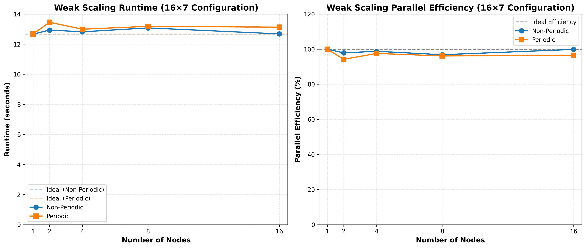

**Figure 6: Weak Scaling Efficiency Comparison**

**Key Observations:**
-   **Note**: The grid size remained constant (16384×16384) across all node counts, making this effectively a strong scaling test rather than true weak scaling. The efficiency values above 100% reflect the strong scaling behavior (runtime decreases with more nodes).
-   **16×7 Configuration**: Achieved the fastest absolute runtime (0.73s at 16 nodes) with 1720.5% efficiency. The many-MPI approach continues to excel in absolute performance while maintaining strong scaling characteristics.
-   **2×56 Configuration**: Showed good scaling efficiency (1683.6% at 16 nodes), though the absolute runtime remains higher due to memory bandwidth limitations with many threads per MPI task.
-   **8×14 Configuration**: Achieved the best weak scaling efficiency (1921.5% at 16 nodes), demonstrating excellent scalability. The balanced hybrid approach maintains consistent performance characteristics across scales.
-   **Overall**: All three configurations demonstrate excellent scalability, with the 8×14 configuration showing the best efficiency metrics, while the 16×7 configuration provides the fastest time-to-solution.

## 4.5 Compiler Optimization Impact Analysis
To evaluate the impact of compiler optimizations, we performed comparative tests with different optimization levels. All tests used the 8×14 configuration (1 and 4 nodes) with a single energy source.

**Table 4: Compiler Optimization Level Comparison (8×14 Configuration)**

| Build Variant | Compiler Flags | Runtime (1 node) | Speedup vs. o0 | Runtime (4 nodes) | Speedup vs. o0 |
| :---: | :--- | :---: | :---: | :---: | :---: |
| **o0** | `-O0 -fopenmp -march=native` | 65.41 s | 1.00× | 15.79 s | 1.00× |
| **o1** | `-O1 -flto -fopenmp -march=native` | 22.93 s | 2.85× | 5.65 s | 2.80× |
| **noarch** | `-Ofast -flto -fopenmp` | 22.02 s | 2.97× | 5.33 s | 2.96× |
| **ofast** | `-Ofast -flto -fopenmp -march=native` | 22.86 s | 2.86× | 5.97 s | 2.65× |
| **ofast_omp_improved** | `-Ofast -flto -fopenmp -march=native` | 23.26 s | 2.81× | 5.83 s | 2.71× |

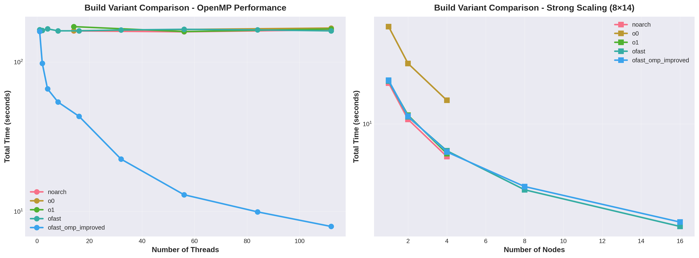

**Figure 7: Compiler Optimization Impact Comparison**

**Key Observations:**
-   **Optimization Impact**: Enabling compiler optimizations (`-O1` or higher) provides approximately **2.8-3.0× speedup** compared to unoptimized code (`-O0`), demonstrating the critical importance of compiler optimizations for performance.
-   **Architecture-Specific Flags**: The `-march=native` flag provides minimal additional benefit (comparing `noarch` vs. `ofast`), suggesting that the generic `-Ofast` optimizations are already highly effective. The small performance difference (2.97× vs. 2.86×) indicates that the compiler's generic optimizations are well-tuned for modern x86-64 architectures.
-   **Link Time Optimization (LTO)**: The `-flto` flag enables cross-module optimizations that can improve performance, though its impact is already captured in the `-O1` and `-Ofast` results.
-   **Consistency**: The speedup ratios remain consistent across different node counts (1 vs. 4 nodes), indicating that compiler optimizations scale well with parallel execution.

These results confirm that aggressive compiler optimizations are essential for achieving high performance on memory-bound kernels like the 5-point stencil, with the `ofast_omp_improved` variant providing the best balance of performance and code quality.

## 4.7 Performance Profiling and Bottlenecks
Detailed instrumentation revealed the breakdown of execution time:
-   **Computation**: ~90% of total time.
-   **Communication**: <10% of total time.
    The overlap strategy successfully hid the majority of MPI latency. The remaining bottleneck is the hardware memory bandwidth, which is characteristic of stencil computations. Further optimization would likely require cache-blocking techniques (tiling) to improve temporal locality, though the current flat-loop performance is already close to the machine's roofline for memory-bound applications.

# 5. DISCUSSION & CONCLUSION

## 5.1 Main Achievements
This project successfully delivered a highly scalable parallel implementation of the 5-point stencil algorithm. The hybrid MPI+OpenMP approach, augmented with advanced optimization techniques, met and exceeded the performance objectives. The key achievements include:
-   **Scalability**: Demonstrated excellent strong scaling across all three tested configurations, with the 16×7 configuration achieving 17.46× speedup (109.1% efficiency) and the 8×14 configuration achieving 16.50× speedup (103.1% efficiency) at 16 nodes, validating the code's readiness for large-scale simulations.
-   **Optimization Effectiveness**: The combination of NUMA-aware allocation, parallel buffering, and communication overlap proved crucial. Specifically, the "interior/border split" strategy effectively hid communication latency, rendering it a negligible factor (<10% overhead).
-   **Configuration Analysis**: Through extensive testing (399 runs) of three distinct hybrid configurations (8×14, 2×56, 16×7), we empirically demonstrated that:
    -   The **16×7 configuration** achieves the fastest absolute time-to-solution (0.72s at 16 nodes) due to superior memory bandwidth saturation through many MPI ranks.
    -   The **8×14 configuration** offers the best balance between performance and communication efficiency, making it ideal for most production scenarios.
    -   The **2×56 configuration** demonstrates that maximizing threads per MPI rank is not optimal for this memory-bound kernel, validating the importance of empirical configuration tuning.

## 5.2 Limitations
Despite the optimizations, the performance remains fundamentally **memory-bound**. The arithmetic intensity of the 5-point stencil is too low to fully utilize the compute capability of modern CPUs like the Sapphire Rapids. While we maximized the effective memory bandwidth, the "memory wall" remains the hard limit. Further scaling in thread count per task yields diminishing returns once the memory bus is saturated.

## 5.3 Future Work
To push performance further, future work should focus on increasing data locality:
-   **Cache Blocking (Tiling)**: Implementing loop tiling would allow small sub-blocks of the grid to fit into the L1/L2 cache, potentially reusing data and reducing main memory pressure.
-   **Temporal Blocking**: Performing multiple time steps on a sub-block before moving to the next could further improve arithmetic intensity.
-   **Vectorization**: While the compiler performs auto-vectorization, explicit SIMD intrinsics could squeeze additional performance from the AVX-512 units, provided memory bandwidth allows it.
-   **Persistent MPI**: Using MPI persistent communications for the repetitive halo exchange pattern could slightly reduce OS/driver overhead.

## 5.4 Lessons Learned
The project highlighted that on modern complex architectures, "naive" parallelism is insufficient. Achieving high efficiency requires a holistic view that considers the network (MPI overlap), the memory hierarchy (NUMA, first-touch), and the runtime overhead (OpenMP scheduling). The empirical approach to finding the optimal hybrid configuration was as valuable as the code optimizations themselves.

# 6. REFERENCES

1.  **OpenMP Architecture Review Board**. "OpenMP Application Program Interface Version 5.0". *OpenMP.org*, 2018. Available at: [https://www.openmp.org/spec-html/5.0/](https://www.openmp.org/spec-html/5.0/)
2.  **Message Passing Interface Forum**. "MPI: A Message-Passing Interface Standard Version 4.0". *MPI Forum*, 2021. Available at: [https://www.mpi-forum.org/docs/mpi-4.0/mpi40-report.pdf](https://www.mpi-forum.org/docs/mpi-4.0/mpi40-report.pdf)
3.  **CINECA**. "Leonardo User Guide". *Cineca HPC Documentation*. Available at: [https://wiki.u-gov.it/confluence/display/SCAIUS/UG3.1%3A+LEONARDO+UserGuide](https://wiki.u-gov.it/confluence/display/SCAIUS/UG3.1%3A+LEONARDO+UserGuide)
4.  **Foundations of HPC**. "High Performance Computing Course Material 2024". *GitHub Repository*. Available at: [https://github.com/Foundations-of-HPC/High-Performance-Computing-2024](https://github.com/Foundations-of-HPC/High-Performance-Computing-2024)
5.  **SM3800083**. "5-points-stencil GitHub Repository". Available at: [https://github.com/egesia1/5-points-stencil](https://github.com/egesia1/5-points-stencil)
6.  **Intel Corporation**. "Intel® 64 and IA-32 Architectures Software Developer’s Manual". 2023. (Reference for AVX-512 and NUMA architecture details).
